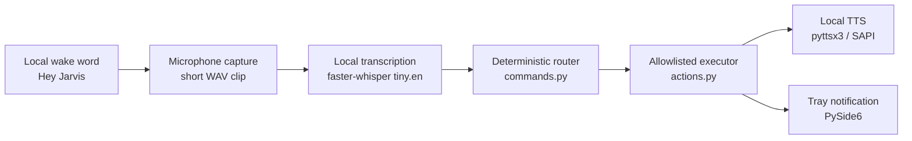

# DeskPilot Architecture

DeskPilot is a local-first Windows assistant built around deterministic routing and explicit execution allowlists.

## Native Flow

The native shell runs with `python -m deskpilot_backend.desktop`. Wake-word listening is off by default unless local settings enable it. When enabled, openWakeWord listens locally for "Hey Jarvis". On detection, DeskPilot stops the wake-word microphone stream, records one command clip, transcribes it locally, routes it through the deterministic command router, and executes only allowlisted actions.

The overlay is visual feedback only:

- Cyan: listening for the command
- Amber: processing transcription and action handling
- Green: success
- Red: recoverable error or unknown command

## Command Routing

`commands.py` normalizes case, whitespace, and terminal punctuation, then maps exact English phrases to typed command responses. Parameterized commands exist only where explicitly implemented, such as bounded search, notes, and reminders. DeskPilot does not use fuzzy matching, LLM interpretation, or synonyms outside the defined command table.

## Allowlisted Execution

`actions.py` is the execution boundary. It uses fixed action types and targets for applications, websites, searches, media keys, workspace shortcuts, system status, notes, reminders, and settings. DeskPilot never passes arbitrary text to a shell, executable path, URL opener, or filesystem path.

## Settings

Settings are stored in `~/Documents/DeskPilot/settings.json` and created only when missing. They control command capture duration, recording-start cue, wake listening on startup, and safe custom aliases. Invalid settings fall back to safe defaults without rewriting the user's file.

Custom aliases can only map a user phrase to an existing fixed command, such as `"open my projects": "open github"`. Aliases cannot target media controls, notes, reminders, parameterized search, arbitrary URLs, paths, shell commands, or executables.

## Notes And Reminders

Notes are local UTF-8 `.txt` files under `~/Documents/DeskPilot/notes`. DeskPilot generates note filenames internally and does not accept spoken paths or filenames.

Reminders are stored in `~/Documents/DeskPilot/reminders.json`. Pending reminders are reloaded on startup and scheduled locally. When due, DeskPilot shows a native tray notification and narrates `Reminder: <text>` using local TTS.

## Safety Boundaries

DeskPilot is English-only and local-first. It does not call cloud AI services, execute arbitrary commands, accept arbitrary paths or URLs, run shell commands, or listen continuously for full speech transcription. Wake-word detection only triggers a short local command capture.
