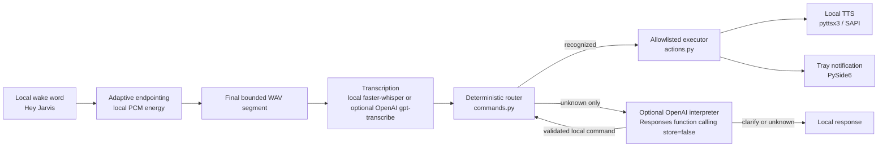

# DeskPilot Architecture

DeskPilot is a local-first Windows assistant built around deterministic routing and explicit execution allowlists.

## Native Flow

The native shell runs with `python -m deskpilot_backend.desktop`. Wake-word listening is off by default unless local settings enable it. When enabled, openWakeWord listens locally for "Hey Jarvis". On detection, DeskPilot stops the wake-word microphone stream and starts local adaptive command endpointing.

Endpointing is deterministic and local. DeskPilot reads short 16 kHz mono PCM frames, waits for consecutive frames above an energy threshold, keeps a small pre-roll so command starts are not clipped, and ends capture after sustained trailing silence. The existing command capture duration setting remains the hard maximum, so noisy environments cannot keep the microphone open beyond the validated local limit. If no speech is detected, no audio is sent to transcription and DeskPilot reports that it did not hear a command.

Only the final bounded command WAV segment is sent to the selected transcription provider. The rest of the flow routes the resulting text through the deterministic command router and executes only allowlisted actions.

The overlay is visual feedback only:

- Cyan: listening for the command
- Amber: processing transcription and action handling
- Green: success
- Red: recoverable error or unknown command

## Command Routing

`commands.py` normalizes case, whitespace, and terminal punctuation, then maps exact English phrases to typed command responses. Parameterized commands exist only where explicitly implemented, such as bounded search, notes, and reminders.

The deterministic router is always the first path. If it returns unknown, the optional command interpreter may use the OpenAI Responses API with model `gpt-6-luna`, function calling, strict schemas, `store=false`, `parallel_tool_calls=false`, and exactly one accepted tool call. It sends only the current transcript plus static allowed-command metadata. It does not send notes, reminders, settings, history, file contents, or local paths.

The interpreter cannot execute anything. It may propose one existing fixed command ID, a note/reminder/search payload, a short clarification with up to two fixed-command choices, or unknown. Local code validates the result by routing it back through `commands.py` and executing only through `actions.py`.

## Allowlisted Execution

`actions.py` is the execution boundary. It uses fixed action types and targets for applications, websites, searches, media keys, workspace shortcuts, system status, notes, reminders, and settings. DeskPilot never passes arbitrary text to a shell, executable path, URL opener, or filesystem path.

## Settings

Settings are stored in `~/Documents/DeskPilot/settings.json` and created only when missing. They control command capture duration, recording-start cue, wake listening on startup, transcription provider, command interpreter provider, and safe custom aliases. Invalid settings fall back to safe defaults without rewriting the user's file.

Custom aliases can only map a user phrase to an existing fixed command, such as `"open my projects": "open github"`. Aliases cannot target media controls, notes, reminders, parameterized search, arbitrary URLs, paths, shell commands, or executables.

## Notes And Reminders

Notes are local UTF-8 `.txt` files under `~/Documents/DeskPilot/notes`. DeskPilot generates note filenames internally and does not accept spoken paths or filenames.

Reminders are stored in `~/Documents/DeskPilot/reminders.json`. Pending reminders are reloaded on startup and scheduled locally. When due, DeskPilot shows a native tray notification and narrates `Reminder: <text>` using local TTS.

## Safety Boundaries

DeskPilot is English-only and local-first. Optional OpenAI transcription and command interpretation are explicitly configured by environment/settings and may incur API cost. DeskPilot does not execute arbitrary commands, accept arbitrary paths or URLs, run shell commands, call OpenAI built-in tools, or listen continuously for full speech transcription. Wake-word detection only triggers a short bounded command capture.
